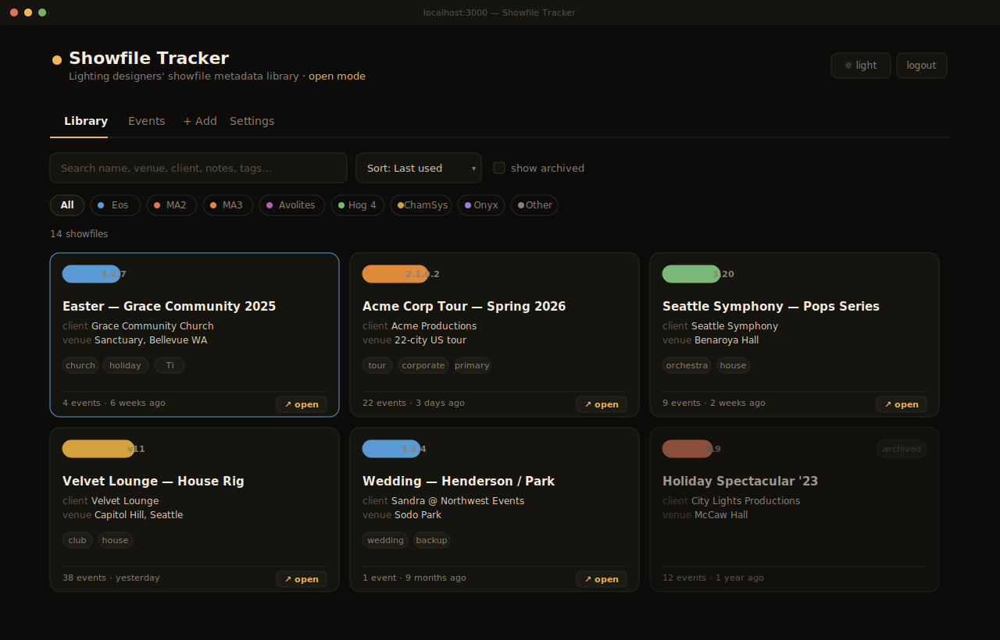
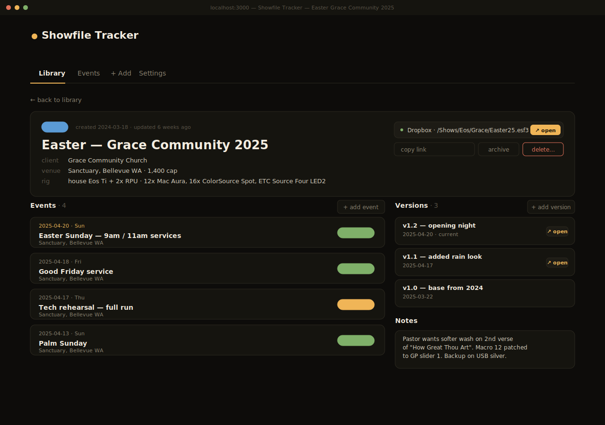
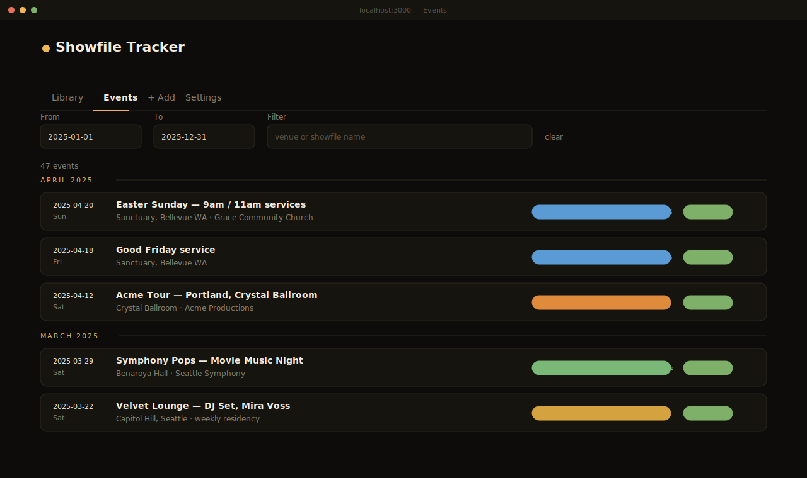
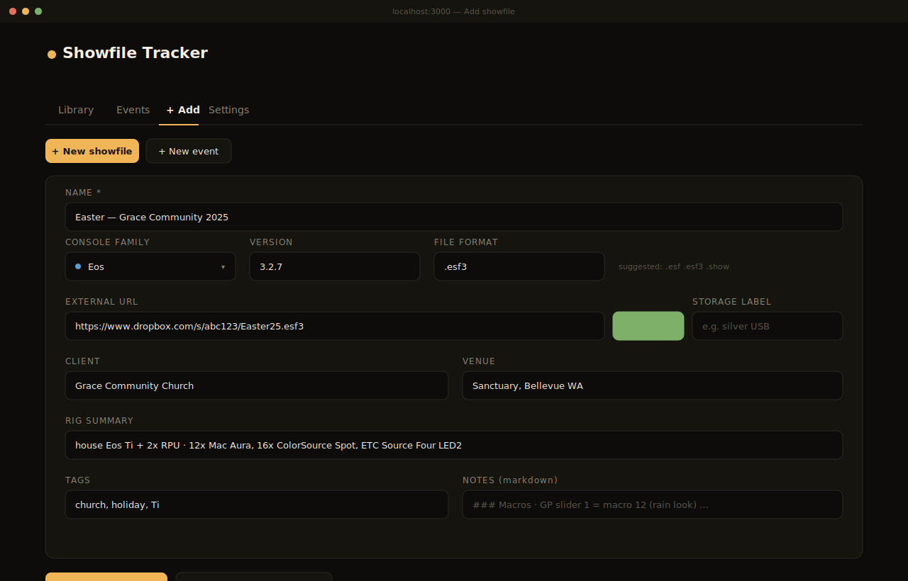
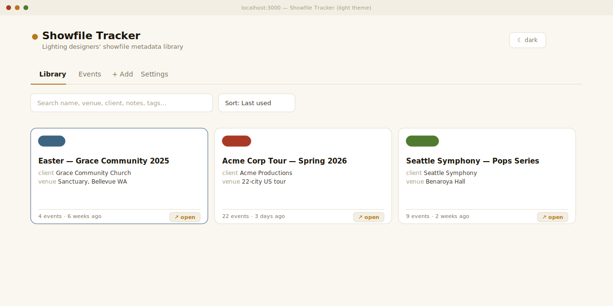

# Showfile Tracker

> Open-source showfile metadata library for lighting designers.

*"Where's the showfile for the church gig last September on the Eos Ti?"*

Currently solved with sticky notes, badly-named folders, and the LD's memory. **Showfile Tracker** is a single-file SQLite database plus a clean UI to log every showfile, every gig it ran on, the console + version, the venue, the rig, the notes — and where the actual file lives in your existing storage (Dropbox, iCloud, Google Drive, OneDrive, USB stash).

It does **not** host the files. It tracks the **metadata + an external link**, so your files stay wherever you already keep them.



---

## Table of contents

- [Why it exists](#why-it-exists)
- [Screens](#screens)
- [Features](#features)
- [Quickstart](#quickstart)
- [Configuration](#configuration)
- [Deployment](#deployment)
- [Console family support](#console-family-support)
- [Storage providers](#storage-providers)
- [Data model](#data-model)
- [REST API](#rest-api)
- [CSV import / export](#csv-import--export)
- [Backup](#backup)
- [Privacy](#privacy)
- [Project layout](#project-layout)
- [v2 ideas](#v2-ideas)
- [License](#license)
- [Author](#author)

---

## Why it exists

Working LDs accumulate dozens to hundreds of showfiles across many years, many consoles, many clients. The questions that come up:

- *What version of Eos was I on at that church last Easter?*
- *Did I run a backup off the Acme tour rig, or did Sandra?*
- *Where's the file? Dropbox or the silver USB or laptop downloads?*
- *Was that an MA2 show or did we update to MA3 mid-run?*

Filenames and folders don't carry enough metadata. Showfile Tracker does. The whole app fits in a single SQLite file you can copy, sync, or check into Git — no cloud account, no subscription, no telemetry.

---

## Screens

### Showfile detail — events, versions, notes

A full record per showfile: title, console + version, storage location with one-click open, rig summary, every event the file ran on, named iterations ("v1.1 — added rain look") with their own URL, and Markdown-rendered notes.



### Events timeline

Every gig in chronological order, grouped by month, filterable by date range and venue / showfile name. Each row links back to the parent showfile and the console it ran on.



### Add showfile

One form, storage auto-detected from the URL, suggested file formats per console family.



### Light theme

Dark default — consoles live in dark venues — but light is one click away for the office.



> All screens above are SVG mockups rendered from the live theme palette (`src/theme.js`), so colors, layout, and pill / chip styling match the running app pixel-for-pixel.

---

## Features

**Library**
- Grid of showfile cards with console badge, last-used date, event count, one-click "open external file"
- Full-text search across name, venue, client, notes, tags, rig summary
- Filter by console family (Eos / MA2 / MA3 / Avolites / Hog 4 / ChamSys / Onyx / Other)
- Toggle archived rows in / out
- Sort by last-used, name, created, or client

**Showfile detail**
- Inline-editable fields (click anything to edit, blur to save)
- Multiple **events** per showfile with date, venue, role (primary / backup / derived-from)
- Multiple **versions** per showfile ("v1.0 — opening night", "v1.1 — added rain") with their own optional URL
- Markdown-rendered notes
- Storage location detected from URL (Dropbox, iCloud Drive, Google Drive, OneDrive, SharePoint, Box, MEGA, pCloud) plus a free-text "storage label" for the off-cloud cases (silver USB, laptop downloads, vault drive)
- Archive / restore / delete with confirmation
- Copy-link helper

**Events**
- Standalone events tab with date-range and venue filtering
- Grouped by month
- Logging an event auto-updates the parent showfile's `last_used_at` so the library sorts by recency

**Data**
- Single SQLite file with WAL mode + foreign keys on
- Schema auto-migrates on every boot (idempotent `CREATE TABLE IF NOT EXISTS`)
- CSV import + export (full round-trip — showfiles, events, and versions all in one bundle, with dry-run preview)
- Backup is `cp showfiles.db backups/...` — that's the whole story

**Themes**
- Dark default, light toggle
- Theme choice persisted to `localStorage`
- Warm amber accent inspired by tungsten / sodium stage washes

**Auth**
- **Open mode** (default): no password, ideal for solo desktop or Tailscale / VPN
- **Gated mode**: set `AUTH_PASSWORD` to enable session cookie + CSRF, helmet headers, rate-limiting on login

---

## Quickstart

```bash
git clone https://github.com/<you>/showfile-tracker.git
cd showfile-tracker
npm install
npm run build
npm start
```

Open <http://localhost:3000> — that's it. The SQLite file is created automatically on first boot.

### Development mode

Two processes, side-by-side:

```bash
npm run dev:server   # Express API on :3000
npm run dev          # Vite dev server on :5173, proxies /api → :3000
```

> **Node 24 on Windows note:** `better-sqlite3` v12+ ships prebuilt binaries for Node 24. Older versions fall through to a source build and need Python + a C++ toolchain. This repo already pins v12+, so a clean `npm install` works without extra setup.

---

## Configuration

| Variable | Default | Purpose |
| --- | --- | --- |
| `PORT` | `3000` | HTTP port |
| `AUTH_PASSWORD` | *(unset)* | Set to gate the app with session + CSRF auth |
| `SESSION_SECRET` | random per boot | HMAC key for session cookies. **Set persistently if hosting**, otherwise logins reset on every restart |
| `SHOWFILES_DB` | `./showfiles.db` | Path to the SQLite file |
| `NODE_ENV` | `production` | Set to `development` to drop the secure-cookie flag for local HTTP |

### Open mode vs. gated mode

- **Open mode** (`AUTH_PASSWORD` unset): no login, an `· open mode` badge appears in the header. Perfect for solo desktop, internal LAN, or behind Tailscale.
- **Gated mode** (`AUTH_PASSWORD` set): one shared password, session cookie + CSRF token, helmet security headers, login rate-limiting. **Required** if you put this on the public internet.

---

## Deployment

### Local

A single Node process serves both the built frontend and the API:

```bash
npm run build && npm start
```

Run it on boot via `pm2`, `systemd`, `launchd`, Windows Service Manager — whatever you already use.

### Railway / Nixpacks

`nixpacks.toml` is included; Railway / Render / any nixpacks-compatible host detects it automatically. The image installs `nodejs_20`, `python3`, `gcc`, and `gnumake` so `better-sqlite3` can fall back to a source build if no prebuild matches the target.

Point a persistent volume at `SHOWFILES_DB=/data/showfiles.db` and set `AUTH_PASSWORD` and `SESSION_SECRET`.

### Docker

Not bundled, but trivial:

```dockerfile
FROM node:20-alpine
RUN apk add --no-cache python3 make g++
WORKDIR /app
COPY package*.json ./
RUN npm ci --omit=dev
COPY . .
RUN npm run build
ENV SHOWFILES_DB=/data/showfiles.db
VOLUME /data
EXPOSE 3000
CMD ["node", "server.cjs"]
```

---

## Console family support

The metadata captured is **console-agnostic**. The console family field exists for organization, filtering, and color coding — not for parsing the file. v1 does not read showfile contents.

| Family | Color | Typical formats |
| --- | --- | --- |
| Eos | <kbd style="background:#5b9bd5;color:#fff">&nbsp;blue&nbsp;</kbd> | `.esf` `.esf3` `.show` |
| MA2 | <kbd style="background:#d97757;color:#fff">&nbsp;warm red&nbsp;</kbd> | `.show` |
| MA3 | <kbd style="background:#e08b3c;color:#fff">&nbsp;orange&nbsp;</kbd> | `.show3` |
| Avolites | <kbd style="background:#b85cb8;color:#fff">&nbsp;magenta&nbsp;</kbd> | `.lpx` `.avo` |
| Hog 4 | <kbd style="background:#7ab877;color:#fff">&nbsp;green&nbsp;</kbd> | `.shw` |
| ChamSys | <kbd style="background:#d4a23e;color:#fff">&nbsp;gold&nbsp;</kbd> | `.msq` |
| Onyx | <kbd style="background:#9b7ed6;color:#fff">&nbsp;purple&nbsp;</kbd> | `.onyx` |
| Other | <kbd style="background:#8a8270;color:#fff">&nbsp;grey&nbsp;</kbd> | — |

Adding a family is a one-liner in `src/theme.js → CONSOLE_FAMILIES` plus an entry in `server/showfiles.cjs → CONSOLE_FAMILIES`. PRs welcome.

---

## Storage providers

When you paste an external URL into the showfile form, the app detects the storage provider and shows a colored chip. Recognized hosts:

| Host | Label |
| --- | --- |
| `dropbox.com` | Dropbox |
| `icloud.com` | iCloud Drive |
| `drive.google.com` | Google Drive |
| `onedrive.live.com`, `1drv.ms` | OneDrive |
| `sharepoint.com` | SharePoint |
| `box.com` | Box |
| `mega.nz` | MEGA |
| `pcloud.com` | pCloud |

Anything else is fine — the URL is stored as-is and the chip is hidden. For files on USB / local-only drives, leave the URL blank and put a memorable string in the **storage label** field ("silver USB", "vault drive G:\Shows", etc.).

---

## Data model

```
showfiles
  ├─ id (uuid)
  ├─ name, console_family, console_version, file_format
  ├─ external_url, storage_location_label
  ├─ client, venue, rig_summary, notes (markdown), tags
  ├─ archived (bool)
  ├─ created_at, updated_at
  └─ last_used_at  ← recomputed from events on insert/update/delete
       ├─ showfile_events   (1:N — date, venue, role, notes)
       └─ showfile_versions (1:N — label, optional URL, notes)
```

- SQLite, **WAL mode**, **foreign keys on**, indexed on the common access paths (`console_family`, `archived + last_used_at`, `client`; events on `showfile_id + event_date`; versions on `showfile_id + created_at`).
- Schema is applied on every boot via idempotent `CREATE TABLE IF NOT EXISTS` — no migration tool needed.
- Wipe `showfiles.db` to start clean.

---

## REST API

All routes are prefixed with `/api`. JSON in, JSON out. CSRF token required for unsafe verbs in gated mode (the frontend handles it automatically).

### Showfiles

| Method | Path | Purpose |
| --- | --- | --- |
| `GET` | `/showfiles` | List, with `?console=`, `?archived=all`, `?q=` filters |
| `GET` | `/showfiles/:id` | Detail (includes events + versions) |
| `POST` | `/showfiles` | Create |
| `PATCH` | `/showfiles/:id` | Partial update |
| `POST` | `/showfiles/:id/archive` | Archive |
| `POST` | `/showfiles/:id/restore` | Restore |
| `DELETE` | `/showfiles/:id?confirm=true` | Hard delete (cascades to events + versions) |

### Events

| Method | Path | Purpose |
| --- | --- | --- |
| `GET` | `/events` | List with `?from=YYYY-MM-DD&to=YYYY-MM-DD`, joined to showfile |
| `POST` | `/events` | Create — auto-recomputes parent `last_used_at` |
| `PATCH` | `/events/:id` | Partial update — auto-recomputes |
| `DELETE` | `/events/:id` | Delete — auto-recomputes |

### Versions

| Method | Path | Purpose |
| --- | --- | --- |
| `GET` | `/showfiles/:id/versions` | List |
| `POST` | `/showfiles/:id/versions` | Create |
| `DELETE` | `/versions/:id` | Delete |

### Misc

| Method | Path | Purpose |
| --- | --- | --- |
| `GET` | `/stats` | Counts by family, archived, total events, etc. |
| `GET` | `/export/csv` | Download full library as one CSV |
| `POST` | `/import/csv?dry=1` | Preview-only import (returns counts) |
| `POST` | `/import/csv` | Commit import (inserts new rows) |

---

## CSV import / export

The export is a single CSV with a `row_type` column. `row_type=showfile` rows contain showfile fields; `row_type=event` / `row_type=version` rows reference a showfile via `external_id` (the showfile UUID) OR by exact name match.

Workflow:

1. Settings → **Export CSV** to download a snapshot.
2. Edit in Excel / Numbers / a text editor.
3. Settings → pick file → **Preview** to see the row counts it *would* import (no writes happen).
4. **Commit** to apply.

This is the migration path in **and** out — no lock-in.

---

## Backup

```bash
cp showfiles.db backups/showfiles-$(date +%F).db
```

Or use the **Export CSV** button in Settings. Or just point `SHOWFILES_DB` at a path inside your existing Dropbox / iCloud folder and let it sync — SQLite WAL mode is fine with that for single-user use (don't share writes across machines simultaneously).

---

## Privacy

Your data is **local**. The default deployment is a single SQLite file on your machine or your own server. **No cloud, no telemetry, no third-party calls.** The only outbound HTTP the app makes is loading the Inter / JetBrains Mono fonts from Google Fonts (and even that's a CSS `@import` — substitute or remove in `src/theme.js → fontImport` if you'd rather it be fully offline).

If you host this somewhere, your data is wherever you put it. Set `AUTH_PASSWORD` before exposing the URL.

---

## Project layout

```
showfile-tracker/
├── server.cjs              # Express entry: helmet, sessions, CSRF, static dist/
├── server/
│   ├── db.cjs              # better-sqlite3 + schema + last_used_at recompute
│   ├── showfiles.cjs       # /showfiles, /events, /versions, /stats routes
│   └── import-export.cjs   # CSV in / out
├── src/                    # React 18 frontend (Vite)
│   ├── App.jsx             # shell, tabs, theme, auth gate
│   ├── Library.jsx         # grid + filters + chips
│   ├── ShowfileDetail.jsx  # inline-edit detail + events + versions
│   ├── Events.jsx          # timeline view
│   ├── AddShowfile.jsx     # new-showfile form w/ storage detection
│   ├── AddEvent.jsx        # new-event form
│   ├── Settings.jsx        # stats + import/export
│   ├── api.js              # fetch wrappers + CSRF
│   ├── theme.js            # palette, fonts, console families
│   └── ui.js               # shared styles (cards, inputs, pills, dates)
├── docs/screenshots/       # SVG renders of the UI (used in this README)
├── dist/                   # built frontend (created by `npm run build`)
├── nixpacks.toml           # Railway / nixpacks deploy config
└── showfiles.db            # the database (created on first boot, gitignored)
```

---

## v2 ideas

PRs welcome on any of these:

- File uploads (with durable object storage so the open-source story stays clean)
- Showfile parsing (read `.esf` to extract patch / cue counts automatically)
- Apple / Google Calendar sync for events
- Multi-user / sharing
- Print views ("Show binder" PDF per showfile)
- Mobile-native shell

Open an issue with a use case if you want to push one of these forward.

---

## License

MIT. See [LICENSE](LICENSE).

---

## Author

Built by **Tanner Harrison** — 12+ years professional LD, NW Lighting.

Built because I needed it and assumed other LDs probably do too. If you find it useful, ⭐ the repo or send a note about how you're using it.
